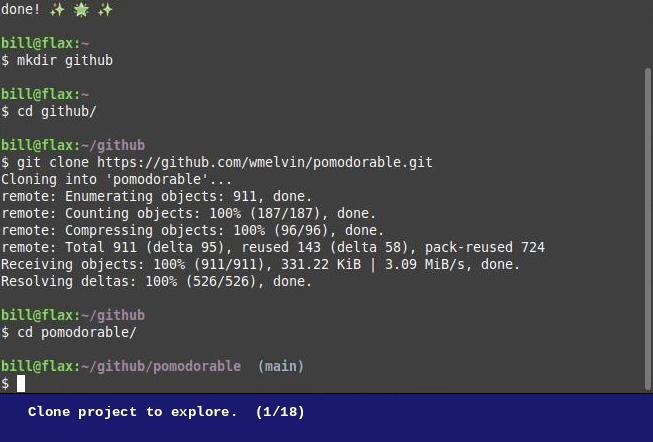

# GitRamble

`gitramble` - Ramble through a project's `git log` history. 

A command-line utility that provides a [Textual](https://textual.textualize.io/) UI to select and checkout git commits as new banches. This is for exploring a project's history and checking out the code at selected commits along the way. Most likely this is done in a separate clone of a project's repository.

> Development work in progress.

### WARNING: Running this might mess up your git repository.

**This tool is in development. For anyone curious enough to try this out, you should do so in a separate repository that you do not need, or are confident you can recover if things go wrong.**

## Screenshots



## Command-line Usage

```
usage: gitramble [-h] [-u REPO_URL] [dir_name]

Explore git commit history...

positional arguments:
  dir_name              Name of directory containing the Git repository.

options:
  -h, --help            show this help message and exit
  -u REPO_URL, --repo-url REPO_URL
                        GitHub repository URL.

```

## Reference

### Packages Used

*(TODO)*

### Project Tools

*(TODO)*
