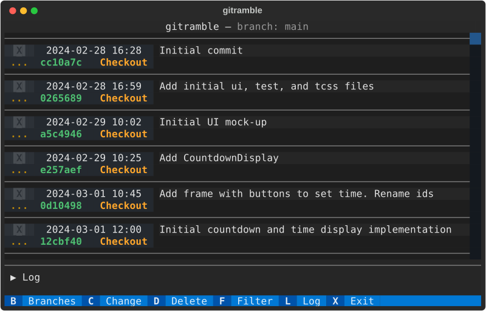

# GitRamble

`gitramble` - Ramble through a project's `git log` history.

A command-line utility that provides a [Textual](https://textual.textualize.io/) UI to select and checkout git commits as new banches. This is for exploring a project's history and checking out the code at selected commits along the way. Most likely this is done in a separate clone of a project's repository.

> Development work in progress.

### WARNING: Running this might mess up your git repository.

**This tool is in development. For anyone curious enough to try this out, you should do so in a separate repository that you do not need, or are confident you can recover if things go wrong.**

## Screenshots



**More screenshots:**

- [Select Commit and Insert Note](screenshots/gitramble-1-select-note.md)

- [Filter on Selected Commits](screenshots/gitramble-2-filter.md)

- [Open Commit on GitHub](screenshots/gitramble-3-github.md)

- [Checkout New Branch](screenshots/gitramble-4-checkout.md)

- [Change Branch](screenshots/gitramble-5-change.md)

- [Delete Branch](screenshots/gitramble-6-delete.md)

## Command-line Usage

```
usage: gitramble [-h] [-u REPO_URL] [dir_name]

Explore git commit history...

positional arguments:
  dir_name              Name of directory containing the Git repository.

options:
  -h, --help            show this help message and exit
  -u REPO_URL, --repo-url REPO_URL
                        GitHub repository URL.

```

## Reference

### Packages Used

- [Textual](https://textual.textualize.io/) - Textual User Interface framework

### Project tools

- [Pipenv](https://github.com/pypa/pipenv#readme) - Python virtual environment and package management
- [Build](https://build.pypa.io/en/stable/) - Python packaging build frontend
- [Ruff](https://docs.astral.sh/ruff/) - linter and code formatter (integrated with Hatch)
- [pytest](https://docs.pytest.org/en/stable/) - testing framework
- [Just](https://github.com/casey/just#readme) - command runner

#### Textual Development Tools

- Textual [Devtools](https://textual.textualize.io/guide/devtools/)
- [tcss-vscode-extension](https://github.com/Textualize/tcss-vscode-extension#readme): VS Code extension that enables syntax highlighting for Textual CSS files.

